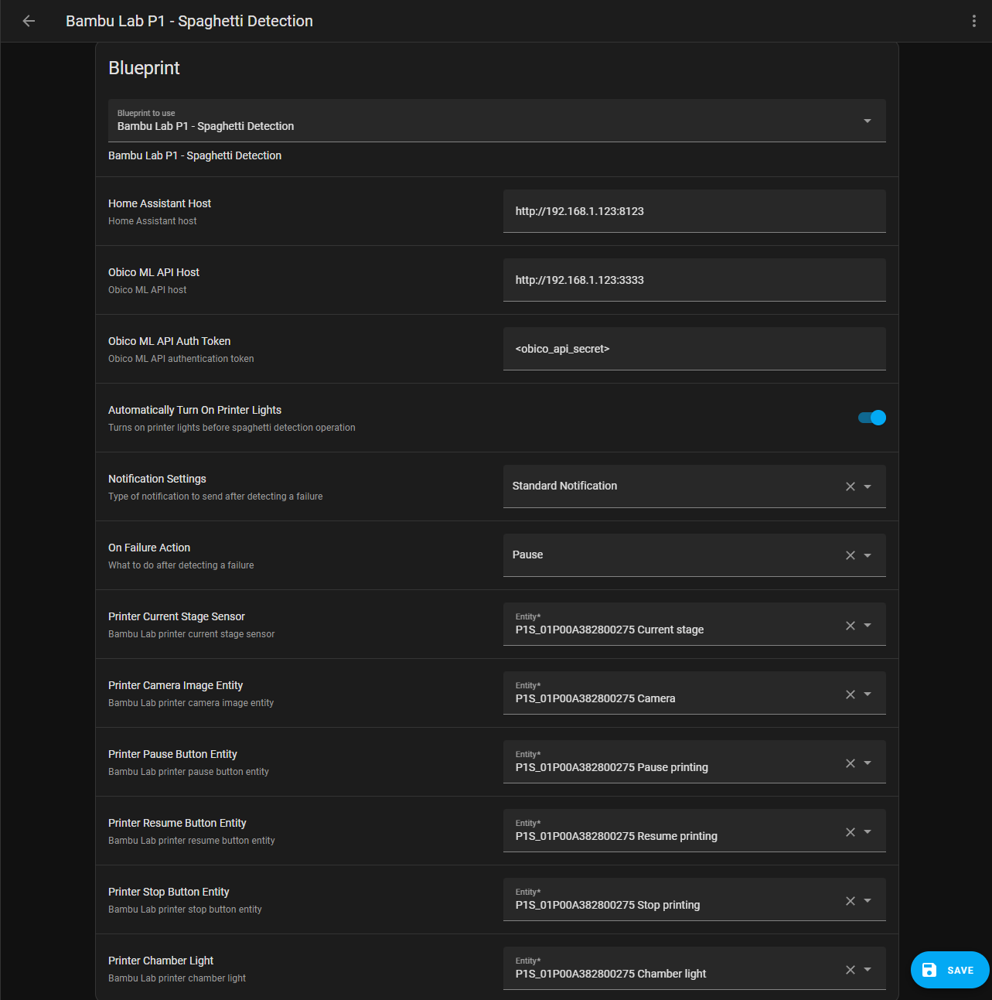

# Bambu Lab P1 - Spaghetti Detection Integration

Upgrade your Bambu Lab P1 3D printer experience with the Home Assistant Spaghetti Detection Integration. This
integration leverages the power of both the [Bambu Lab Integration](https://github.com/greghesp/ha-bambulab) and
the [Obico](https://www.obico.io) ML server, providing a solution for detecting and handling spaghetti incidents during
your prints.

## Features

- **Spaghetti Detection:** Utilize Obico's machine learning server to identify and prevent spaghetti issues.
- **Critical/Standard Notifications:** Stay informed with customizable notifications.
- **Pause/Cancel Print on Failure Detection:** Take proactive measures by automatically pausing or canceling print jobs
  upon the detection of spaghetti-related failures, preventing wasted material and time.

## Prerequisites

Ensure the following prerequisites are met before installing the Spaghetti Detection Integration:

- [Bambu Lab Integration](https://github.com/greghesp/ha-bambulab) must be installed.
- A server with at least 4GB of RAM that meets
  the [Obico hardware requirements](https://www.obico.io/docs/server-guides/hardware-requirements/).

 

> **_NOTE:_** The integration does not support the following devices:

| Device                   | Compatibility | 
|--------------------------|---------------|
| Raspberry Pi (Any Model) | ❌            |
| Home Assistant Green     | ❌            |
| Home Assistant Yellow    | ❌            |
| Latte Panda              | ❌            |
| Jetson Nano 2gb          | ❌            |

## Setup

Follow these steps to set up the Spaghetti Detection Integration:

1. **Install Obico ML Server**
    - Choose between installing it as a Home Assistant Addon or as a standalone Docker container.

2. **Install `Bambu Lab P1 - Spaghetti Detection` Home Assistant Integration**
3. **Install Home Assistant Spaghetti Detection Automation Blueprint**

For detailed installation instructions and troubleshooting tips, refer to
the [Installation Guide](#link-to-installation-guide).

## 1. Install Obico ML Server

### Install Obico ML Server as Home Assistant Addon

To install Obico ML server as a Home Assistant Add-on you have 2 options:

1. Click the **Add Add-On Repository** button below, click **Add → Close** (You might need to enter the **internal
   IP address** of your Home Assistant instance first).

2. Add the repository URL under **Settings → Add-ons → ADD-ON STORE** and click **⋮ → Repositories**:

       https://github.com/nberktumer/ha-bambu-lab-p1-spaghetti-detection

### Install Obico ML Server as a Standalone Docker Container

1. Create docker container using the following command:

       docker create \
         --restart unless-stopped \
         --env ML_API_TOKEN=obico_secret_token \
         --publish 3333:3333 \
         --name ha_bambu_lab_p1_spaghetti_detection \
         nberk/ha_bambu_lab_p1_spaghetti_detection_standalone:latest

2. Start the container using the following command:

       docker start ha_bambu_lab_p1_spaghetti_detection

## 2. Install Home Assistant Integration

### HACS

1. Click the button below to download and install the integration:

2. Go to **Settings → Devices & services → Add Integration** and add **Bambu Lab P1 - Spaghetti Detection** integration.

### Manual

Manually copy the contents of the custom_components folder to your Home Assistant config/custom_components folder. After
restarting Home Assistant, add and configure the integration through the native integration setup.

## 3. Install Home Assistant Automation Blueprint

1. Click the button below to import the Spaghetti Detection blueprint:

2. Go to the imported blueprint and create the automation:

### Blueprint Parameters

| Parameter                   | Description                                                                                                                                                                                                                                                                                                                                     |
|-----------------------------|-------------------------------------------------------------------------------------------------------------------------------------------------------------------------------------------------------------------------------------------------------------------------------------------------------------------------------------------------|
| **Home Assistant Host**     | The address of your Home Assistant instance. Required for sending the printer camera image to the Obico ML server. Ensure to include your Home Assistant port. This address is also used for notification images. If you wish to view failure images on notifications outside your local network, provide a publicly accessible link here. |
| **Obico ML API Host**       | The URL of the Obico ML Server. The default port number is `3333`. If you installed the ML server via the Home Assistant Addon, the IP address should match your Home Assistant address.                                                                                                                                                        |
| **Obico ML API Auth Token** | The authentication token for the Obico ML Server. The default value is `obico_api_secret` and can be configured through the addon settings or the docker container create command.                                                                                                                                                              |
| **Notification Settings**   | - **Critical Notification:** Generates an audible alert even when your device is in silent mode. - **Standard Notification:** Sends a traditional notification respecting your device's audio settings. - **None:** No notifications are sent in case of a failure.                                                                     |

## Credits

- **Greg Hesp ([@greghesp](https://github.com/greghesp))**: https://github.com/greghesp/ha-bambulab
- **Obico ([@TheSpaghettiDetective](https://github.com/TheSpaghettiDetective))**: https://github.com/TheSpaghettiDetective/obico-server
